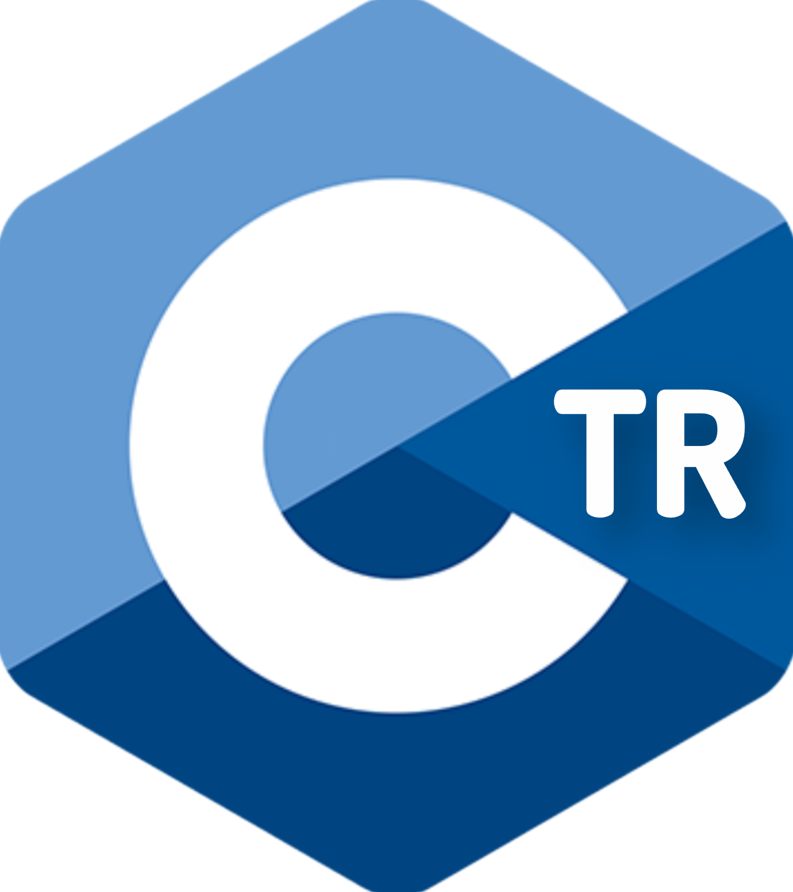

# CtrLang

> **Türkçe backend web dili** — Saf C, SQLite, her platformda.

[](LICENSE)
[]()
[]()
[](https://github.com/darking053official/CtrLang/releases)
[](https://darking053official.github.io/CtrLang/)

[Site](https://darking053official.github.io/CtrLang/) · [Özellikler](#özellikler) · [Kurulum](#kurulum) · [Dil Referansı](#dil-referansı) · [Örnekler](#örnekler)

---
## Kur. Tek komut. Linux-Termux-Mac
```sh
curl -fsSL https://darking053official.github.io/CtrLang/install.sh | sh
```

## Nedir?

**CtrLang**, Türkçe anahtar kelimelerle yazılan bir **backend web dilidir**. PHP ve Node.js'in Türkçe alternatifi olmayı hedefler.

```ctrlang
sunucu başlat(3000)

sayfa "/" {
    yazdır "Merhaba CtrLang!"
}
```

Çalıştır:

```bash
ctr run merhaba.ctr
```

Tarayıcıda: http://localhost:3000

---

Özellikler

· Türkçe sözdizimi — yazdır, eğer, döngü, işlev

· Saf C — Hızlı, hafif (~2 MB bellek)

· SQLite — Yerleşik veritabanı

· HTTP sunucu — Mongoose ile gerçek web sunucusu

· HTML + JSON — Yerleşik üretim

· Dinamik rotalar — /kullanici/{id}

· Çapraz platform — Linux, macOS, Windows, Android

---

Kurulum

Tek Komut (Linux / macOS / Termux)

```bash
curl -fsSL https://darking053official.github.io/CtrLang/install.sh | sh
```

Manuel

```bash
git clone https://github.com/darking053official/CtrLang.git
cd CtrLang
./kur.sh
```

Windows

```cmd
git clone https://github.com/darking053official/CtrLang.git
cd CtrLang
kur.bat
```

---

Kullanım

```bash
ctr new blogum           # Yeni proje oluştur
ctr run app.ctr          # Derle ve çalıştır
ctr run app.ctr -p 8080  # Port belirt
ctr build app.ctr        # C'ye çevir ve derle
ctr check app.ctr        # Sözdizimi kontrol
ctr listele              # Tüm komutlar
ctr update               # Güncelle
```

---

Dil Referansı

Değişkenler

```ctrlang
sayı x = 10
metin isim = "Ali"
mantık aktif = doğru
liste yazilar = veritabanı.sorgu("SELECT * FROM yazilar")
```

Kontrol

```ctrlang
eğer x > 5 {
    yazdır "Büyük"
} değilse {
    yazdır "Küçük"
}

döngü i = 0, i < 10, i = i + 1 {
    yazdır i
}
```

İşlevler

```ctrlang
işlev topla(a, b) {
    döndür a + b
}
```

Web

```ctrlang
sunucu başlat(3000)

sayfa "/" {
    yazdır "Ana sayfa"
}

sayfa "/kullanici/{id}" {
    yazdır "Kullanıcı: " + id
}
```

HTML

```ctrlang
html {
    başlık "Hoş geldin"
    paragraf "CtrLang ile yazıldı"
    düğme "Tıkla"
}
```

Veritabanı

```ctrlang
veritabanı bağlan("blog.db")
veritabanı.çalıştır("CREATE TABLE IF NOT EXISTS yazilar (id INTEGER PRIMARY KEY, baslik TEXT)")
liste yazilar = veritabanı.sorgu("SELECT * FROM yazilar")
```

---

Örnekler

Merhaba Dünya

```ctrlang
sunucu başlat(3000)

sayfa "/" {
    yazdır "Merhaba CtrLang!"
}
```

SQLite Blog

```ctrlang
veritabanı bağlan("blog.db")

veritabanı.çalıştır("CREATE TABLE IF NOT EXISTS yazilar (id INTEGER PRIMARY KEY, baslik TEXT)")

sunucu başlat(3000)

sayfa "/" {
    liste yazilar = veritabanı.sorgu("SELECT * FROM yazilar")
    html {
        başlık "Blogum"
        her yazi içinde yazilar {
            paragraf yazi.baslik
        }
    }
}
```

---

Mimari

```
.ctr dosyası
    ↓
[ Lexer ]      → Token
    ↓
[ Parser ]     → AST
    ↓
[ Üretici ]    → C kodu
    ↓
[ gcc ]        → Yerel binary
    ↓
HTTP Sunucu + SQLite
```

---

Proje Yapısı

```
CtrLang/
├── src/                    # Derleyici (C)
├── kutuphane/              # Runtime
├── vendor/                 # Harici kütüphaneler
├── ornekler/               # .ctr örnekleri
├── kur.sh                  # Linux/macOS/Termux
├── kur.bat                 # Windows CMD
├── kur.ps1                 # Windows PowerShell
└── Makefile
```

---

Yol Haritası

☑ Lexer, Parser, AST

☑ C kodu üretici

☑ HTTP sunucu + HTML + JSON

☑ SQLite + dinamik rotalar

☑ Çapraz platform

☐ Standart kütüphane

☐ Şablon motoru

☐ WebSocket

☐ v1.0

---

Lisans

GNU General Public License v3.0 — LICENSE

Kullanılan kütüphaneler: Mongoose (GPL v2), SQLite (Public Domain), cJSON (MIT), sds (BSD), uthash (BSD).

---

Katkıda Bulunanlar

· darking053official — Proje sahibi

· DeepSeek — AI asistan, kod geliştirme

---

Türkçe programlama için bir adım.
